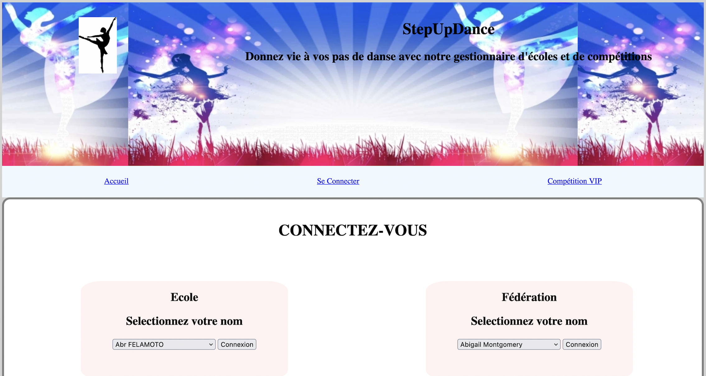

# projet BDW - Information

StepUpDance est site Web réalisé en deuxieme année de la licence informatique, permettant une introduction aux bases de données. 
l'objectif du projet est de développer une application web qui permet de gérer un ensemble d'école de danses et de compétitions organisées par des fédérations. Pour cela, la base de données sur laquelle est appuiyé l'application web a été modélisé et concu selon des spécifications. 
  

## SetUpDance

Bienvenu sur SetUpDance, sur notre site vous pourrez retrouver toutes les informations sur les écoles et les employés. Il est aussi possible de gérer la gestion des informations d'une école, des employés ou biens des adhérents apres connexion. 
Si vous etes adhérents, vous pouvez visualiser votre liste de cours, modifier une affectation de cours ou bien ajouter une nouvelle affectation de cours. 
Si vous etes une fédération, vous pouvez gérer les information de la fédération, des comités, des compétition et les membres de la fédération. 
Bien plus, une fédération peut organiser une édition de compétion VIP dont l'idée est d"inviter des danseurs qui ont été bien classé et selon d'autre critères. 

## Organisation des fichiers/répertoires

-**README.md** : ce readme 

-**bdw.sql** : requete pour creer nos tables

-**requete_statistique** : requete pour faire des statisitque sur les tables

-**BDWebAdmin** : code source du site

